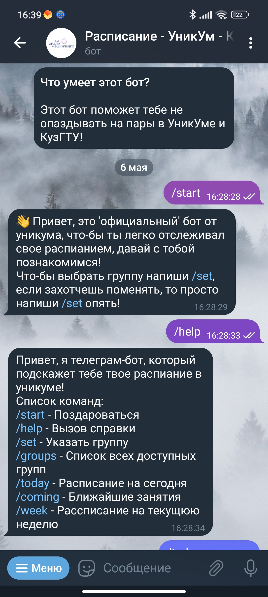
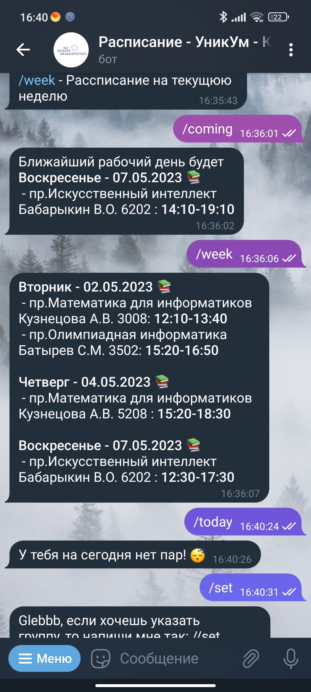
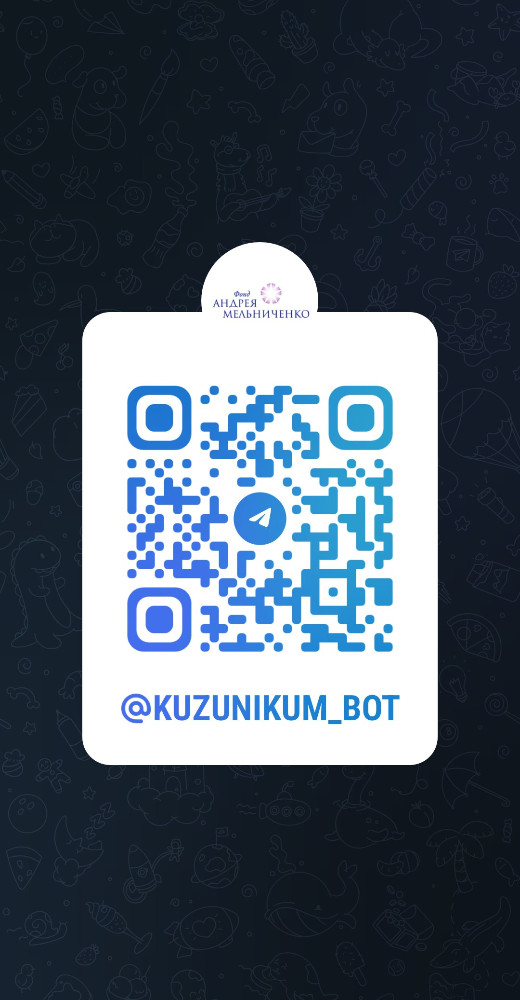

<!-- _paginate: false -->
<!-- _header:  -->

# Бот для просмотра расписания в УникУм и КузГТУ

*Выполнил: Анохин Глеб ИИ-82*

---

## Проблема 

Ученики УникУма и студенты КузГТУ затрачивают много времени на просмотр расписания занятий.
А также часто ошибаются при его поиске из-за чего пропускают занития. 

---

## Актуальность

В КузГТУ обучается более 11 тыс. студентов в 335 различных группах. В УникУме обучается около 500 школьников в 54 группах.

В среднем, что-бы посмотреть актуальное расписание вам необходимо затратить около минуты, на поиск нужной страницы, нужного дня и т.д. 

Также в процессе поиска актуального расписания есть возможность допустить ошибку и открыть расписание чужой группы с похожим названием или не обновить таблицу из-за чего пропустить свои занятия.

---

## Цель и задачи

**Создание телеграм-бота для быстрого доступа к актуальному расписанию учеников УникУм и студентов КузГТУ**

- *Написать парсер для таблиц с расписанием*
- *Создать телеграм-бота*
- *Разместить бота на сервере*

---

## Материалы и оборудование

- Python 3.10
- Python-Модули
  * Aiogram 3
  * httpx и beautifulSoup
  * rutimeparser и datetime
  * sqlite
- VS code
- Marp
- Alwaysdata

--- 

---

## Выводы

- Парсер для таблиц с расписанием был написан и протестирован для расписания Уникум и КузГТУ
- Создан и протестирован телеграмм-бот
- Бот размещен на платформе Alwaysdata

---

## Заключение

У нас получилось создать телеграмм-бота, который  облегчит жизнь студентам КузГТУ и ученикам УникУма.

В ближайшем будущем его функционал будет дополнен,  благодаря чему доступ к расписанию станет еще проще.

---

# Спасибо за внимание 
